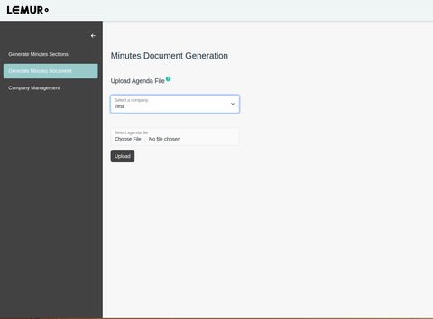
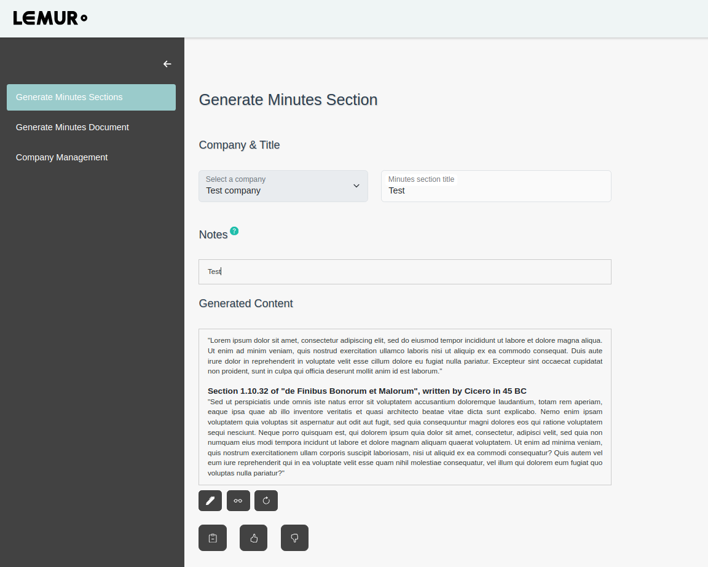

# Lemur Writeup

  

## Purpose

The purpose of Lemur was to increase productivity in paralegal tasks by using LLMs to generate "first draft" documents, requiring only proofreading and finishing touches by a human in order to become professional-grade work product. The initial task chosen for development was the generation of meeting minutes, a rote and tedious process that typically consisted of fleshing out notes or transcriptions and the copying of formulaic legal language.

## Development

Naive approaches, e.g. providing the notes to an LLM with a simple prompt, were not sufficient as the AI would omit information, failed to include language surrounding resolutions and other formalities, etc. Features that were added to bring text quality up to a usable level included a few-shot prompting approach, where several examples of correct style and terminology were included, and a retrieval augmented generation (RAG) algorithm that allowed the inclusion of highly relevant context into the prompt.

During POC stage, the application tightly focused on a "section", i.e. a header and the text associated with it, under the philosophy that the actual generation of high quality text was the crux of the success or failure of the project, and iterating over this smaller task (as opposed to a whole document) would be much faster. Once performance on this initial task was satisfactory, full-document generation was achieved, with the only required human input being the uploading of a file containing notes from the meeting in question. Unfortunately it was at this point that funding issues arose, ending the project. 

Research was performed and several successive POCs were built on a side-project basis during 2024, with the nascent MVP app architected and built as a full-time endeavor during early 2025.

## UI Screenshots

### Full Document Generation Page

  

### Section Generation Page

  

## Architecture Highlights

**-Observability**: Extensive logging that included model inputs/outputs, response time metrics, and vector database operations, all tied to a unique id for each user "interaction". This enabled both real-time monitoring of system behavior and reconstruction of past outputs, in context. Without high observability, LLM-based applications cannot easily scale.

**-Asynchronous from ground up**: Long-running queries were designed to be async and resumable from the ground-up, with visual cues of progress given to the end user. This was crucial for navigating usage limits and LLM API latency issues in a graceful, human-friendly way.

**-Context Window management**: By chunking the task into "sections" and using RAG to manage context, even very large documents could be generated without degradation of outputs by the LLM or "busting" the context window, and token consumption could be mitigated by making retrieval sensitive to context size.

**-Knowledge Augmentation**: Human feedback could be provided by either requesting an edit from the LLM or marking the final output as either very high or very poor quality. By capturing these interactions and feeding them back into the vector database, the system could improve over time by increasing its knowledge of the task's context and the end user's preferences.

**-Evaluation Pipeline**: High system observability and "ground truth" provided in the form of human feedback allowed the creation of an evolvable evaluation pipeline that could be constantly enriched with new user interactions. This enabled rapid iteration on the core LLM algorithm, and facilitated scaling by allowing development to become sensitive to new use cases and user behaviors. 

